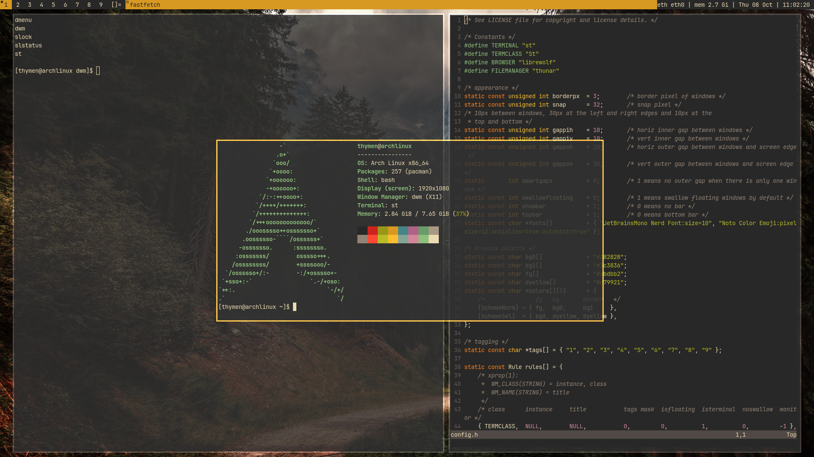

# DWM Auto Rice Bootstrapping Script (DARBS)



My dotfiles for dwm, st, dmenu, slock, slstatus and dunst in the [gruvbox](https://github.com/morhetz/gruvbox) dark palette: [dwm](https://dwm.suckless.org) 6.8 with the vanitygaps, swallow and stacker patches, 3px yellow borders and a plain text status bar. st is [Luke Smith's build](https://github.com/LukeSmithxyz/st), with his patches.

The key bindings are from [Luke Smith's dwm](https://github.com/LukeSmithxyz/dwm), and `sysact`, `displayselect`, `dmenurecord`, `maimpick` and `setbg` are his scripts from [voidrice](https://github.com/LukeSmithxyz/voidrice).

The install scripts support Arch (and Arch based distributions), Fedora and Artix with dinit.

## Installation

**Always check the contents of a script before running it.** Run it as your own user, not as root; it uses `sudo` where needed.

```bash
git clone https://github.com/tcvscheppingen/DARBS.git
cd DARBS
./auto-rice.sh        # on Artix: ./auto-rice-artix.sh
```

Then reboot. The script:
- installs Xorg, the xcompmgr compositor, PipeWire, NetworkManager, Bluetooth, dunst, xss-lock, xwallpaper, unclutter, fonts, LibreWolf, Thunar, Neovim and the build dependencies (see `common.sh` and `auto-rice.sh` for the package lists)
- backs up the configs it replaces to `~/.config/gruvbox-rice-backup-<date>/`
- copies the dotfiles to `~/.config` and `~/.local`, then builds dwm, st, dmenu, slock and slstatus in `~/.local/src` and installs them to `/usr/local`
- offers to start dwm when you log in on TTY1

On Fedora it also adds the LibreWolf repo and installs the JetBrains Mono Nerd Font and xwallpaper from their releases. On Artix it uses dinit services, and Arch's `[extra]` repo for xss-lock.

Already have the packages? `./move-config-files.sh` only copies the dotfiles and builds the suckless programs.

### Starting dwm on login

Without a display manager, add this to your login profile (`~/.bash_profile` or `~/.zprofile`):
```bash
if [ -z "$DISPLAY" ] && [ -n "$XDG_VTNR" ] && [ "$XDG_VTNR" -eq 1 ]; then
    exec startx "$HOME/.config/x11/xinitrc"
fi
```
`xinitrc` sets the wallpaper and starts xcompmgr, slstatus, dunst, unclutter, xss-lock and dwm.

## Patches

The patched source is in `.local/src/dwm`, with the patch files in `patches/`.
- [vanitygaps](https://dwm.suckless.org/patches/vanitygaps/): gaps in every layout (10px between windows, 30px at the left and right edges) and extra layouts such as bstack, spiral, deck and centered master.
- [swallow](https://dwm.suckless.org/patches/swallow/): a program started from st takes the terminal's place until it closes.
- [stacker](https://dwm.suckless.org/patches/stacker/): move windows up and down the stack with the keyboard.

st in `.local/src/st` is [Luke Smith's st](https://github.com/LukeSmithxyz/st) (st 0.8.5, commit `48b8ee6`) with this rice's font and gruvbox cursor colors. His patches are merged into the source, so there are no patch files:
- scrollback, with the mouse wheel and the keyboard
- zoom: change the font size with the keyboard
- alpha: a transparent background (0.8 opacity, as in Luke's build), drawn by the xcompmgr compositor
- xresources: font, colors and alpha can be set in Xresources
- externalpipe, with `st-urlhandler` and `st-copyout`: open or copy a URL, or copy a command's output, from a dmenu list
- boxdraw, ligatures (with HarfBuzz) and font2 (color emoji from Noto Color Emoji)

**unclutter** is the program that hides an idle mouse cursor, not a dwm patch.

## Key bindings

`mod` is the Super key. Only Luke's bindings that work with these patches and programs are included.

| Keys | Action |
|---|---|
| `mod + Return` / `mod + d` | Terminal / run a program (dmenu) |
| `mod + w` / `mod + shift + w` / `mod + r` | Browser / `nmtui` / file manager |
| `mod + q` | Close the window |
| `mod + j/k` / `mod + shift + j/k` | Focus / move the window down or up the stack |
| `mod + v` / `mod + shift + v` | Focus the master / make the window the master |
| `mod + space` / `mod + shift + space` | Swap with the master / toggle floating |
| `mod + h/l` / `mod + o`, `mod + shift + o` | Master area smaller or larger / more or fewer master windows |
| `mod + t y u i` (with `shift`) | Layouts: tile (bstack), spiral (dwindle), deck (monocle), centered master (floating) |
| `mod + shift + f` | Floating layout |
| `mod + 1…9` / `mod + shift + 1…9` | Go to a tag / move the window to a tag |
| `mod + 0` / `mod + Tab` | All tags / previous tag |
| `mod + Left/Right` (with `shift`) | Focus (move the window to) the other display |
| `mod + a` / `mod + shift + a` / `mod + z/x` | Toggle / reset / grow or shrink the gaps |
| `mod + b` | Toggle the bar |
| `mod + minus/equal` / `mod + shift + m` | Volume down or up / mute |
| `mod + Backspace` | System menu: lock, leave or renew dwm, sleep, reboot, shutdown (`sysact`) |
| `mod + F3` | Display arrangement (`displayselect`) |
| `Print` / `shift + Print` | Screenshot / screenshot menu (`maimpick`) |
| `mod + Print` / `mod + Delete` | Start / stop a recording (`dmenurecord`) |
| `mod` + left / right drag | Move / resize a window |

In st, `alt` is the modifier:

| Keys | Action |
|---|---|
| `alt + k/j`, `alt + Up/Down` / `alt + u/d`, `alt + PageUp/PageDown` | Scroll up or down a line / a page (also the mouse wheel) |
| `alt + shift + k/j` / `alt + Home` | Zoom in or out / reset the font size |
| `alt + c` / `alt + v`, `shift + Insert` | Copy / paste |
| `alt + l` / `alt + y` | Open / copy a URL on the screen |
| `alt + o` | Copy a command's output |
| `alt + a` / `alt + s` | More / less opaque |

## Customizing

The suckless programs are configured in `config.h`. After editing, rebuild and choose "renew dwm" in `sysact` to restart dwm without closing your windows:
```bash
cd ~/.local/src/dwm && make && sudo make install
```

- The screen locks after 5 minutes and turns off after 10; change the `xset` lines in `~/.config/x11/xinitrc`.
- The status bar blocks are in `~/.local/src/slstatus/config.h` and `~/.local/bin/statusbar`.
- Notifications are configured in `~/.config/dunst/dunstrc`.
- dwm has no system tray: use `nmtui` for wifi and `blueman-manager` for Bluetooth.

## Credits
- [suckless.org](https://suckless.org) for dwm, st, dmenu, slock, slstatus and the [patches](https://dwm.suckless.org/patches/)
- Luke Smith's [dwm](https://github.com/LukeSmithxyz/dwm) and [voidrice](https://github.com/LukeSmithxyz/voidrice)
- [morhetz/gruvbox](https://github.com/morhetz/gruvbox) and [gruvbox wallpapers](https://gruvbox-wallpapers.pages.dev/)
